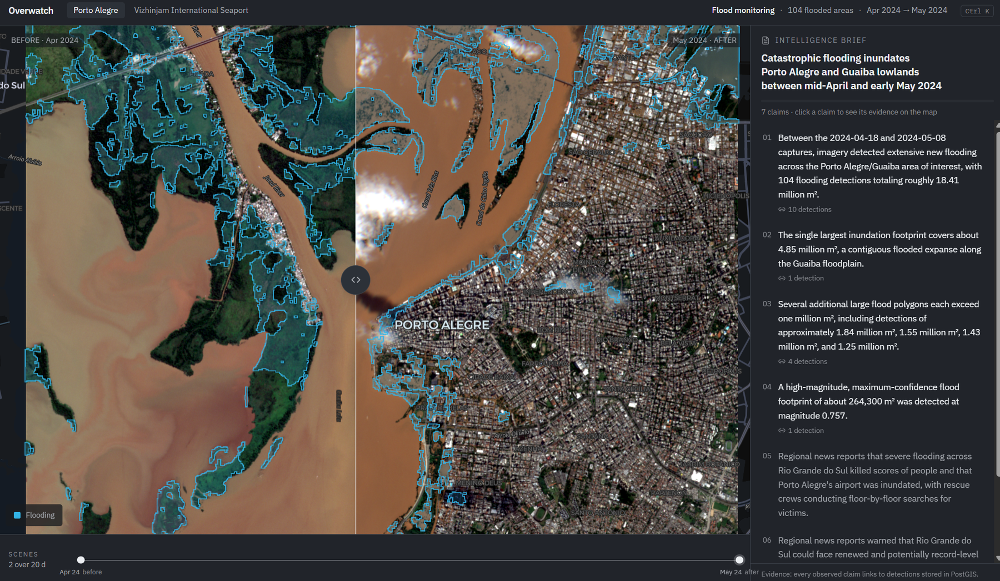

# Overwatch

Satellite change detection with an evidence trail. Give it a place and two dates, and it tells you what changed — with every figure in the written summary traceable back to a specific polygon in the database.



This is a side project, built solo over about seven weeks. It runs on real Sentinel-2 imagery, real Copernicus and INPE ground truth, and a real Claude API key. The accuracy numbers below were measured rather than estimated, and the "What doesn't work" section is deliberately about as long as the rest.

## The two demo areas

**Porto Alegre, Brazil — the May 2024 Rio Grande do Sul floods.** Comparing 18 April against 8 May 2024, the detector emits **104 flood polygons covering 1,841 ha**. The brief written over them links to 11 news articles published in the same window.

**Vizhinjam, India — a deepwater transshipment terminal under construction.** Comparing February 2021 against February 2025 finds **16 construction polygons over 79 ha**, clustered on the terminal itself.

Both are read-only in the demo. The console lets you swipe between the before and after scenes, scrub a timeline, click a polygon to find the sentence that describes it, and click a sentence to fly to the polygons backing it.

## How it works

```text
Earth Search STAC  ──►  scene selection + SCL usability gate
                                    │
                        windowed COG reads, band harmonisation
                                    │
                        ChangeDetector  ──►  PostGIS polygons
                                    │                  │
                        GDELT news fusion              └──►  GeoJSON API ──► React console
                                    │
                        Claude writes a brief  ──►  deterministic validator  ──►  brief API
```

1. **Find usable imagery.** [`imagery/earth_search.py`](backend/src/overwatch/imagery/earth_search.py) queries the Earth Search STAC catalog for Sentinel-2 L2A scenes. Catalog cloud cover only ranks candidates — the actual gate is the fraction of the AOI that reads as usable in the scene's own SCL plane, so a scene with a cloud bank parked outside the AOI still qualifies.
2. **Read only what's needed.** Windowed reads pull red, green, blue, NIR and SCL straight from the public COGs. [`imagery/harmonize.py`](backend/src/overwatch/imagery/harmonize.py) applies the ESA baseline-04.00 DN offset so scenes from either side of the 2022 reprocessing are comparable.
3. **Detect change deterministically.** [`detection/detector.py`](backend/src/overwatch/detection/detector.py) computes spectral index deltas (NDVI, NDWI) and SSIM structural dissimilarity, ANDs a per-vertical set of threshold rules over the usable pixels, cleans the mask with morphological open/close, and polygonises what survives a minimum-area floor. **No model decides whether a pixel changed.**
4. **Join the news.** [`fusion/provider.py`](backend/src/overwatch/fusion/provider.py) retrieves candidate articles from GDELT and hands every one to a pure scorer that applies the date, place and topic gates. Retrieval and judgement are kept apart so the gating is unit-testable without a network.
5. **Write it up, then check it.** Claude receives the detection and article *rows* — never pixels — and writes a brief of typed claims. [`briefs/validator.py`](backend/src/overwatch/briefs/validator.py) then checks it: every observed claim must cite a real detection, quoted areas must reconcile against the linked geometry, dates must match a scene date, and a claim backed only by journalism has to read as reported speech and carry no figures. A failing draft goes back with its violations attached, up to a retry budget.

The point of step 5 is the direction of trust. The language model is the untrusted component; a few hundred lines of regex and arithmetic decide whether its output is allowed to be served.

## Accuracy

Scored against three independent public ground-truth sets. All of these are re-derivable — the commands are in [Verification](#verification).

**Construction, against [OSCD](https://rcdaudt.github.io/oscd/)** (Onera Satellite Change Detection: Sentinel-2 pairs with hand-drawn pixel-level change masks):

| split | scenes | precision | recall | F1 | IoU |
|---|---|---|---|---|---|
| test (held out) | 10 | 0.325 | 0.280 | 0.301 | 0.177 |
| train | 14 | 0.189 | 0.271 | 0.222 | 0.125 |

Measured on the preset exactly as it ships, spatial prior included. Two different limits produce those numbers and they're worth separating:

- **Precision** is a specificity limit. A generic structural-change signal also fires on roads, roofs, bare soil, shadows and seasonal appearance.
- **Recall** is a scope limit, and it's self-inflicted on purpose. The preset keeps only change within 2 km of the largest detection, which is right for watching one port and wrong for a benchmark that labels change across a whole city. On metro-wide scenes precision holds up while recall falls away (chongqing 0.697/0.061, milano 0.823/0.085). OSCD scores this preset conservatively — which is the more useful direction for a benchmark to be wrong in.

The SSIM threshold of `0.55` is the F1 maximum of a 0.40–0.70 sweep on the held-out split. It was set by eye on Vizhinjam imagery eleven days before the OSCD data was downloaded (`git log -S'threshold=0.55'`), so the agreement is external validation rather than curve-fitting.

**Flood, against [Copernicus EMSN194](https://riskandrecovery.emergency.copernicus.eu/)** — the analyst-delineated Porto Alegre flood extent for 8 May 2024: precision **0.586**, recall **0.605**, F1 **0.595**, IoU **0.424**.

One event, one footprint, one date. And one caveat that belongs on every use of it: CEMS produced that delineation from same-day Sentinel-2 plus radar, so the truth is authoritative but **not fully independent** of the optical acquisition being scored.

**Forest, against [INPE PRODES](https://terrabrasilis.dpi.inpe.br/)** — and this one is why forest isn't in the demo. Precision **0.216**, recall **0.384**, F1 **0.277**, with severe location dependence (Novo Progresso collapsed to precision **0.011**). Two-date optical NDVI can't reliably separate permanent clearing from harvest, seasonal change and haze. The vertical was closed as a research extension and removed from the product rather than shown quietly. The negative result is kept in [`benchmarks/results/`](benchmarks/results/).

Port and flood numbers do not transfer to forest. The PRODES run is the evidence they don't.

## Running it

You'll need Docker Desktop with WSL2, Node, and npm. GDAL work happens inside Docker rather than native Windows Python.

```bash
cp .env.example .env          # keep secrets here; never commit it
docker compose up -d postgis redis api
```

```bash
cd frontend
npm install
npm run dev -- --host 0.0.0.0 --port 5173 --strictPort
```

Then open the console at http://localhost:5173/, the API docs at http://localhost:8000/docs, and health at http://localhost:8000/health.

If you keep a local `docker-compose.override.yml` that remaps the API port (this repo's does, to `8001`, because port 8000 is usually taken), point Vite at it:

```bash
VITE_API_PROXY_TARGET=http://127.0.0.1:8001 npm run dev -- --port 5173 --strictPort
```

The Compose `frontend` service is a baked production image with no source bind-mount, so use the host Vite server for development and stop the container if it's holding port 5173.

To stop without losing the database:

```bash
docker compose stop api redis postgis frontend worker beat
```

## Verification

Backend checks run in the API image and need PostGIS:

```bash
docker compose run --rm --no-deps api ruff check src tests
docker compose run --rm --no-deps api ruff format --check src tests
docker compose exec -T api pytest -q
```

Frontend checks run on the host:

```bash
cd frontend
npm run build
npm run test -- --pool=forks --no-file-parallelism
```

Current baseline: **403 backend tests passed, 1 documented xfail** (404 collected) and **18 frontend tests passed**. The xfail is real and tracks the turbid-water limitation described below.

Re-derive the benchmark numbers (OSCD data must be downloaded into `data/oscd/` first — it isn't in the repo):

```bash
docker compose exec -T api python -m overwatch.eval.run_oscd --split test
docker compose exec -T api python -m overwatch.eval.run_oscd --split test --sweep
```

## What doesn't work

The honest list, because a demo that only shows the good parts isn't worth much.

- **Flood detection can't tell shaded vegetation from water.** NDWI rises when a canopy is shaded, so a dark hillside can clear both flood rules. The fix is SWIR — water absorbs it almost totally whatever its sediment load, and vegetation doesn't — but the ingestion set currently fetches only red/green/blue/NIR/SCL. This is tracked as a failing-by-design test rather than hidden, and an absolute after-image gate was tried for it and withdrawn the same day because it rejected 1,007 ha of the genuine turbid floodwater it was meant to keep.
- **Nothing runs on a schedule.** The weekly re-check logic exists and is unit-tested, but no scheduled job has ever actually fired. Every pipeline run in this repo was submitted by hand.
- **Live GDELT fusion is blocked.** The current IP has a long-lived rate-limit block, so the news in the demo was fetched earlier and stored. Vizhinjam has no articles at all.
- **The validator checks areas and dates, not everything.** Percentages and bare numbers in observed claims aren't cross-checked, and the area check fails *open* on units it can't parse (acres, "sq km"). "Every area figure reconciles against the linked geometry and every date matches a scene date" is true. "Every number is checked" is not.
- **Benchmarks aren't reproducible from a clean clone.** `data/` is gitignored, so OSCD (~490 MB) has to be downloaded by hand, and the EMSN194 and PRODES archives aren't kept locally at all — only their results, with the SHA-256 of each source archive recorded.
- **Nothing here has been load-tested.** Two areas of interest, a handful of pipeline runs, one machine. A full run takes six to fifteen minutes.
- **The frontend bundle is 2.06 MB** (582 kB gzipped). Code splitting is an open follow-up.
- **Detection `confidence` is not a probability.** It's the fraction of pixels inside a polygon that exceeded the rule threshold. Useful for ranking, meaningless as a certainty.

## Stack

**Backend** — FastAPI, SQLAlchemy, PostGIS, Celery, Redis, Rasterio, Shapely, Pydantic v2, Alembic.
**Frontend** — React 19, Vite, TypeScript, TanStack Query, MapLibre GL v5, deck.gl, Tailwind.
**Evaluation** — a small harness in [`overwatch.eval`](backend/src/overwatch/eval/) that scores the shipped presets against OSCD, EMSN194 and PRODES, writing results with the truth archive's SHA-256 and the detector commit that produced them.

## Further reading

- [PROJECT.md](PROJECT.md) — scope, and what may and may not be claimed from each result
- [CONTEXT.md](CONTEXT.md) — domain glossary and the gotchas that cost the most time
- [PROGRESS.md](PROGRESS.md) — running log, including the accuracy corrections
- [design-specs/](design-specs/) and [plans/](plans/) — the design documents each phase was built from

## License

MIT. See [LICENSE](LICENSE).
